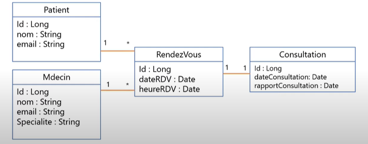

<h1 style="text-align: center;">Rapport de Projet Hospital Project</h1>
<h2>Introduction</h2>

Le présent rapport est consacré au projet 
"Hospital Project", une application de gestion
hospitalière conçue pour illustrer divers concepts de développement logiciel,
de gestion de données et de création d'API REST en utilisant le framework Spring Boot.
 

Nous explorerons ici les différentes composantes du projet, notamment sa conception, 
sa structure, et l'utilisation des annotations clés pour la configuration et la gestion 
des entités, des repositories, et des contrôleurs REST. De plus, nous détaillerons la 
configuration de la base de données utilisée, H2 en mémoire, ainsi que la création des 
relations entre les entités du projet.

L'objectif de ce rapport est de présenter une vue d'ensemble complète du projet 
"Hospital Project" en mettant l'accent sur les concepts et les techniques clés utilisés 
pour son développement.

<h2>Conception du Projet</h2>

<h2>Structure du Projet</h2>

Le projet "Hospital Project" est organisé en plusieurs packages et comprend les éléments suivants :

<ol>
  <li><strong>ma.meriem.hospitalProject.entities :</strong>
    Ce package contient les classes qui représentent les entités du projet.
    <ul>
      <li><strong>Patient :</strong> Cette classe représente les patients de l'hôpital. Elle comprend des informations telles que le nom du patient, sa date de naissance, son état de maladie et une relation vers les rendez-vous associés.</li>
      <li><strong>Medecin :</strong> Cette classe représente les médecins travaillant à l'hôpital. Elle inclut des informations telles que le nom du médecin, son adresse e-mail, sa spécialité (cardiologue ou dentiste) et une relation vers les rendez-vous associés.</li>
      <li><strong>RendezVous :</strong> Cette classe représente les rendez-vous entre les patients et les médecins. Elle comprend des informations sur la date du rendez-vous, son statut (en attente, annulé ou effectué), ainsi que des relations vers le patient, le médecin et la consultation associée.</li>
      <li><strong>Consultation :</strong> La classe Consultation est liée à un rendez-vous et contient des informations sur la date de la consultation et un rapport médical.</li>
    </ul>
  </li>

  <li><strong>ma.meriem.hospitalProject.repositories :</strong>
    Ce package contient les interfaces de gestion des données pour chaque entité, utilisant Spring Data JPA pour effectuer les opérations de base.
  </li>

  <li><strong>ma.meriem.hospitalProject.service :</strong> Ce package contient l'interface IHospitalService et son implémentation HospitalServiceImpl. L'interface définit des méthodes pour sauvegarder des patients, des médecins, des rendez-vous, et des consultations. L'implémentation utilise les repositories pour gérer les entités et crée des relations entre elles.</li>

  <li><strong>ma.meriem.hospitalProject.web :</strong> Ce package contient le contrôleur PatientRestController, qui expose une API REST pour récupérer la liste des patients.</li>
</ol>

<h2>Utilisation des Annotations</h2>

Les annotations sont largement utilisées dans le projet pour configurer les entités, les repositories, et les contrôleurs REST. Voici un résumé des annotations clés et de leur utilité :

<ol>
  <li><strong>Annotations liées aux entités :</strong>
    <ul>
      <li><strong>@Entity :</strong> Marque les classes comme des entités persistantes, mappées sur des tables de base de données.</li>
      <li><strong>@Id :</strong> Définit un champ comme la clé primaire de l'entité.</li>
      <li><strong>@GeneratedValue(strategy = GenerationType.IDENTITY) :</strong> Définit la stratégie de génération des valeurs de la clé primaire, indiquant que la base de données génère automatiquement les valeurs.</li>
      <li><strong>@JsonProperty(access = JsonProperty.Access.WRITE_ONLY) :</strong> Contrôle la sérialisation JSON des entités en excluant certains champs de la réponse JSON.</li>
      <li><strong>@Enumerated(EnumType.STRING) :</strong> Utilisée pour stocker 
les valeurs d'une énumération sous forme de chaînes de caractères dans la base
de données, ce qui facilite la lisibilité des données.</li>
<li><strong>@AllArgsConstructor:</strong> Cette annotation est généralement associée au framework Lombok. 
 Elle génère automatiquement un constructeur qui prend tous les champs 
 de la classe en tant que paramètres. Cela simplifie la création d'instances de
 la classe en évitant d'écrire manuellement 
 un constructeur avec de nombreux paramètres.</li>
<li><strong>@NoArgsConstructor:</strong> Cette annotation, également associée à Lombok, génère
un constructeur sans aucun paramètre. Cela permet de créer des instances de la classe sans avoir 
à spécifier de valeurs pour les champs. Ces constructeurs sont couramment utilisés dans les 
classes d'entités pour permettre la création d'instances vides.
</li>
<li><strong>@Data:</strong>  Cette annotation de Lombok génère automatiquement des méthodes
getter, setter, equals(), hashCode(), et toString() pour tous les champs de la classe. Cela réduit
considérablement le code boilerplate en évitant d'écrire manuellement ces méthodes. 
L'annotation @Data simplifie la gestion des entités en automatisant la génération de ces
méthodes essentielles.
</li>
</ul>
  </li>

  <li><strong>Annotations liées aux repositories :</strong>
    <ul>
      <li><strong>@Repository :</strong> Indique que la classe est un composant de persistance Spring, activant la création automatique d'une implémentation de l'interface par Spring Data JPA.</li>
      <li><strong>JpaRepository :</strong> L'interface fournit des méthodes de base pour effectuer des opérations de CRUD sur l'entité correspondante.</li>
    </ul>
  </li>
<li><strong>Annotations liées aux services :</strong>
    <ul>
      <li><strong>@Service :</strong>Cette annotation est utilisée pour indiquer que la classe est un composant de service Spring. Elle permet à Spring de détecter automatiquement cette classe lors de la configuration de l'application. Dans ce contexte, HospitalServiceImpl est marqué comme un service, ce qui signifie qu'il contient la logique métier de l'application.</li>
      <li><strong>@Transactional:</strong> Cette annotation est utilisée pour indiquer que les méthodes de cette classe sont transactionnelles. Elle permet de gérer les transactions de base de données. Lorsqu'une méthode annotée avec @Transactional est appelée, une transaction est créée, et en cas d'exception, la transaction est annulée, assurant la cohérence des données. Cela garantit que les opérations de base de données sont atomiques.</li>
    </ul>
  </li>

  <li><strong>Annotations liées aux contrôleurs REST :</strong>
    <ul>
      <li><strong>@RestController :</strong> Marque les classes comme des contrôleurs REST, permettant d'exposer des points d'API HTTP.</li>
      <li><strong>@GetMapping :</strong> Définit les méthodes comme des gestionnaires de requêtes HTTP GET pour des chemins d'URL spécifiques.</li>
      <li><strong>@Autowired :</strong> Utilisée pour injecter automatiquement les dépendances, permettant d'accéder aux ressources nécessaires, comme les repositories, dans les contrôleurs.</li>
    </ul>
  </li>

  <li><strong>Annotation @Bean pour la Configuration des Beans :</strong>
    <ul>
      <li><strong>@Bean :</strong> Utilisée pour créer un bean personnalisé de type CommandLineRunner, gérant des dépendances, personnalisant le comportement du démarrage de l'application, centralisant la configuration, et exécutant des tâches spécifiques au lancement de l'application.</li>
    </ul>
  </li>
</ol>
<h2>Configuration de la Base de Données</h2>
<b>Le projet utilise une base de données H2 en mémoire. La configuration de la source de données se fait dans le fichier application.properties. La base de données est accessible via la console H2 avec le paramètre spring.h2.console.enabled activé.</b>
<h2>Création des Relations entre les Entités</h2>

<ul>
<li> Création d'Entités et de Relations dans l'Application </li>
<h3>Patients</h3>

Pour créer un patient, on crée une instance de la classe Patient, on lui attribue les informations nécessaires, puis on utilise la méthode savePatient de l'interface IHospitalService pour le sauvegarder. Les patients sont associés aux rendez-vous via une relation OneToMany.

<h3>Medecins</h3>

Pour créer un médecin, on crée une instance de la classe Medecin, on lui attribue les informations nécessaires, puis on utilise la méthode saveMedecin de l'interface IHospitalService pour le sauvegarder. Les médecins sont également associés aux rendez-vous via une relation OneToMany.

<h3>Rendez-vous</h3>

La création d'un rendez-vous nécessite la définition de la date, du statut, du patient et du médecin correspondant. On utilise la méthode saveRendezVous pour sauvegarder le rendez-vous. Les rendez-vous sont liés aux patients et aux médecins via des relations ManyToOne.

<h3>Consultation</h3>

Pour enregistrer une consultation, on crée une instance de la classe Consultation, on attribue la date et le rapport, puis on utilise la méthode saveConsultation de l'interface IHospitalService. La consultation est associée à un rendez-vous via une relation OneToOne.

<h3>Gestion des Patients via le Contrôleur REST</h3>

Dans cette section, nous aborderons la gestion des 
patients aen utilisantun contrôleur REST. Ce contrôleur permet d'exposer une API HTTP pour récupérer la
liste des patients.la réponse au format JSON

<h3>Affichage de l'ID du Rendez-vous</h3>

 on affiche l'ID du rendez-vous que nous venez de sauvegarder en imprimant la valeur de saveRDV.getId(). 

</ul>
<h2>Conclusion</h2>

En conclusion, le projet "Hospital Project" est une démonstration réussie de
la puissance de Spring Boot pour simplifier le développement d'applications Java.
À travers l'étude de sa conception, de sa structure,
et de l'utilisation des annotations, nous avons pu 
appréhender de nombreux aspects essentiels de la création d'applications professionnelles. 

La configuration de la base de données H2 en mémoire a permis de stocker et de gérer
efficacement les données tout au long du projet. De plus, la création des relations entre
les entités a illustré la manière dont Spring Data JPA facilite l'établissement de liens
entre les entités. 

Enfin, l'exposition d'une API REST pour la gestion des patients a montré comment Spring Boot simplifie le développement de points d'accès HTTP, tout en renvoyant des données au format JSON pour une intégration transparente avec d'autres systèmes.

